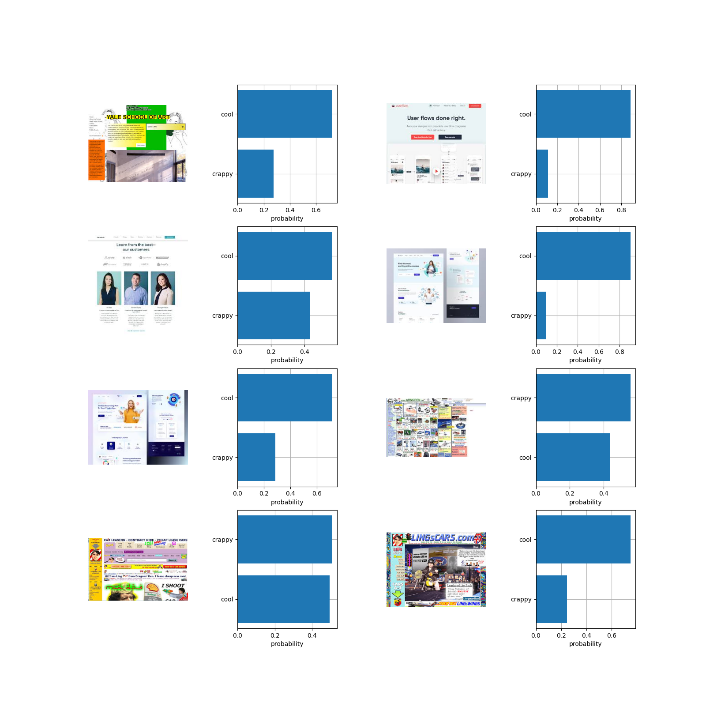

# ask-clip
OpenAI CLIP based web design assistant PoC

## Sys Requirements
 This code needs a machine with CUDA toolkit installed. Will not work on Mac.

## Geting Started
- Create Python virtual environment and activate it.
- Install Pytorch with CUDA using [this instructions](https://pytorch.org/get-started/locally/).
- in your shell run `pip install -r requirements.txt`

## Using ask-clip

- Download files of web designs you want to classify with CLIP in a local project directory
- Crete your own test as follows:
```python
  
test1 = {
    'image_dir': './images/',
    'scale': {'crappy': 'crappy website', 'cool': 'cool website'},
    'plot_labels': ['crappy', 'cool'],
}

```
- run main.py and examine the output!

Here is an example output:



While creating scale for classification do  *[Prompt Engineering](https://blog.roboflow.com/openai-clip-prompt-engineering/)* careful. The output of classification depends a lot on the text prompts- the set of values of `scale` dictionary.